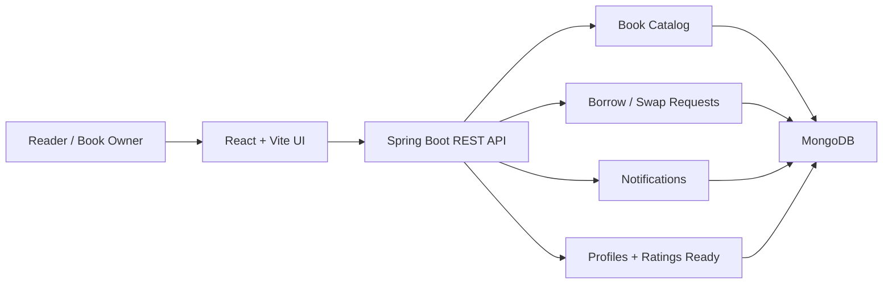

# Architecture

## Runtime Flow

1. Readers register and maintain a personal library.
2. Owners list books with title, author, genre, location, condition, and availability type.
3. Readers search the catalog and send borrow or swap requests.
4. Owners review requests in the dashboard and approve, reject, or mark books returned.
5. Request status changes create notification records for the affected user.

## Scalability Notes

- Current notifications are stored as MongoDB records and loaded by polling/API calls.
- The backend can be extended with Spring WebSocket or Server-Sent Events by publishing notification events from `RequestController`.
- Redis can be added for notification fanout and catalog caching when traffic grows.
